> **Historical draft — superseded by database schema 1.0.0 and current implementation.** Không dùng file này làm specification hiện hành.

# 02. Quy trình nghiệp vụ (Workflow)

Tài liệu này chi tiết hóa các luồng nghiệp vụ (Workflows) thuộc Module Account. Mỗi quy trình bao gồm mô tả, dữ liệu đầu vào (Input), đầu ra (Output), quy tắc nghiệp vụ (Business Rules), lưu đồ (Flowchart) và sơ đồ tuần tự (Sequence Diagram).

---

## 1. Đăng ký tài khoản Sinh viên (Student Register)

### Mô tả
Sinh viên đăng ký tài khoản mới để tham gia học tập và tương tác với AI.

* **Input:** `email` (string), `password` (string), `fullName` (string), `studentCode` (string, MSV), `dateOfBirth` (date: YYYY-MM-DD).
* **Output:** Tài khoản được tạo thành công với trạng thái `ACTIVE` kèm profile Sinh viên.
* **Quy tắc nghiệp vụ:**
  - `email` và `studentCode` phải là duy nhất (unique) trong hệ thống.
  - Tài khoản tự động ở trạng thái `ACTIVE` ngay sau khi tạo thành công.
  - Mật khẩu phải được hash bằng bcrypt trước khi lưu trữ.

### Lưu đồ (Flowchart)
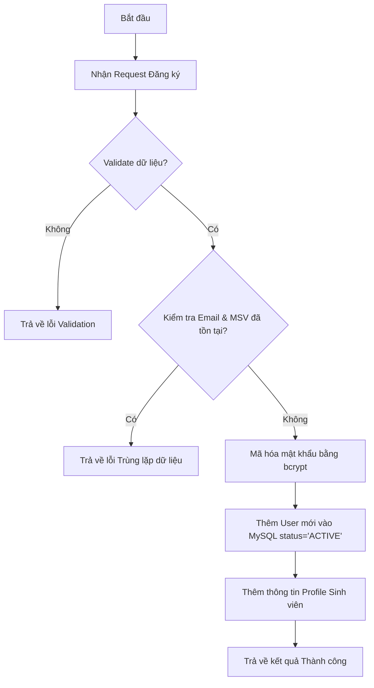

### Sơ đồ tuần tự (Sequence Diagram)
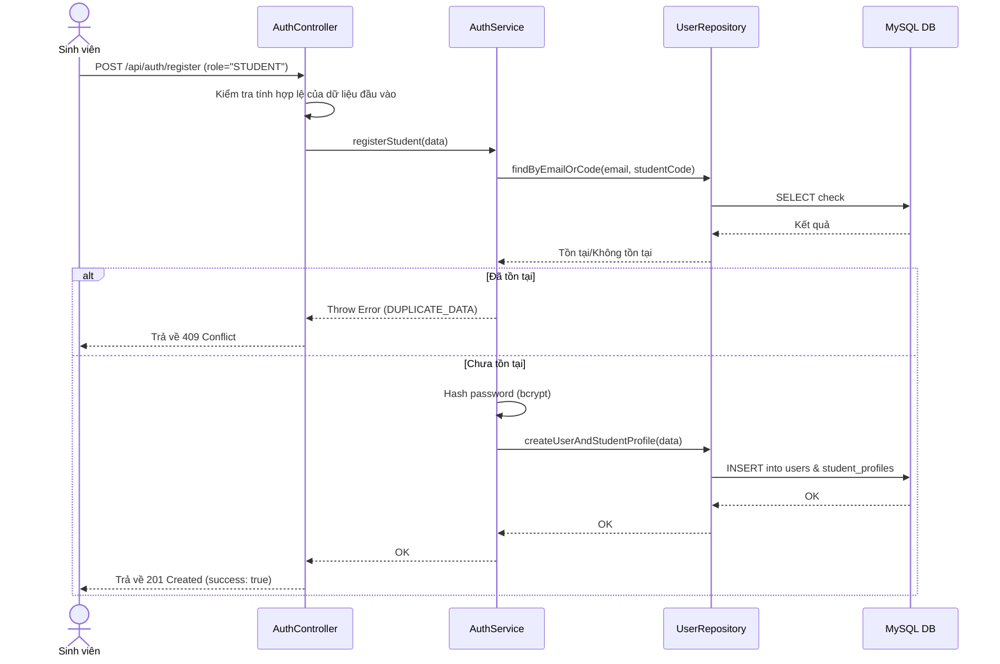

---

## 2. Đăng ký tài khoản Giảng viên (Teacher Register)

### Mô tả
Giảng viên đăng ký tài khoản mới để tải học liệu lên hệ thống.

* **Input:** `email` (string), `password` (string), `fullName` (string), `academicTitle` (string, optional), `degree` (string, optional), `department` (string).
* **Output:** Tài khoản được tạo ở trạng thái `PENDING` và gửi yêu cầu phê duyệt đến Admin.
* **Quy tắc nghiệp vụ:**
  - `email` phải là duy nhất.
  - Tài khoản ở trạng thái `PENDING`. Giảng viên chưa thể đăng nhập cho đến khi được Admin phê duyệt.

### Lưu đồ (Flowchart)
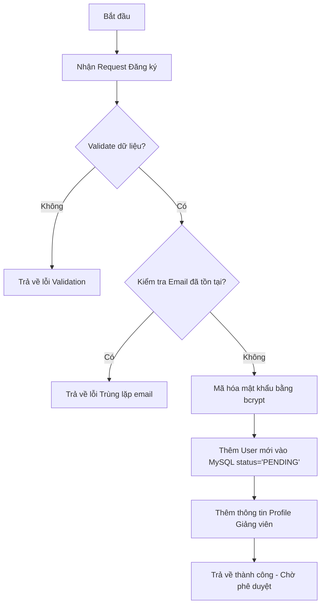

### Sơ đồ tuần tự (Sequence Diagram)
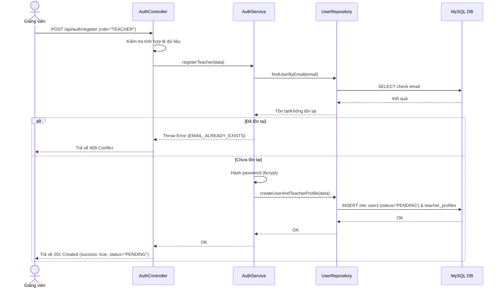

---

## 3. Đăng nhập (Login)

### Mô tả
Đăng nhập vào hệ thống để lấy mã xác thực JWT.

* **Input:** `email` (string), `password` (string).
* **Output:** JWT Token (nếu thành công).
* **Quy tắc nghiệp vụ:**
  - Tài khoản đăng nhập phải ở trạng thái `ACTIVE`.
  - Nếu trạng thái là `PENDING`, `LOCKED` hoặc `REJECTED`, từ chối đăng nhập và báo lỗi tương ứng.
  - So khớp mật khẩu đã hash qua `bcrypt.compare`.

### Lưu đồ (Flowchart)
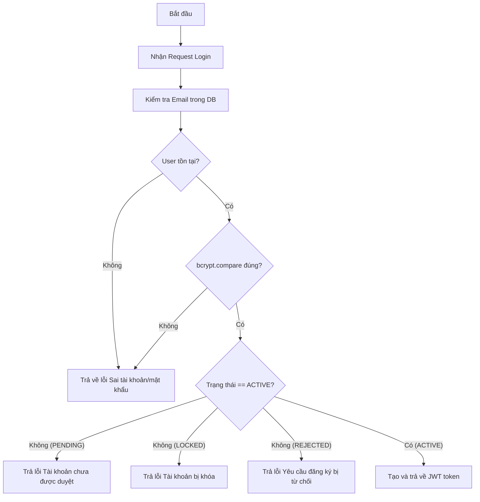

### Sơ đồ tuần tự (Sequence Diagram)
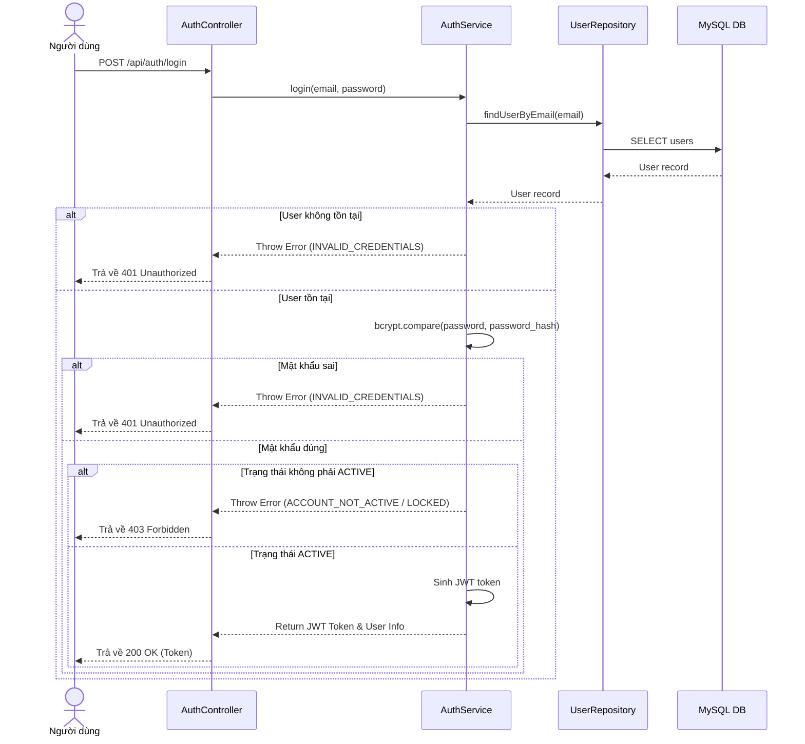

---

## 4. Đăng xuất (Logout)

### Mô tả
Đăng xuất tài khoản người dùng và hủy phiên đăng nhập ở Client.

* **Input:** JWT token gửi kèm trong HTTP Header.
* **Output:** Trả về thông báo đăng xuất thành công.
* **Quy tắc nghiệp vụ:**
  - Vì JWT là stateless, Client chỉ cần tự xóa token ở local storage.
  - Về phía server, ghi nhận nhật ký (nếu có) hoặc phản hồi thành công trực tiếp.

### Sơ đồ tuần tự (Sequence Diagram)
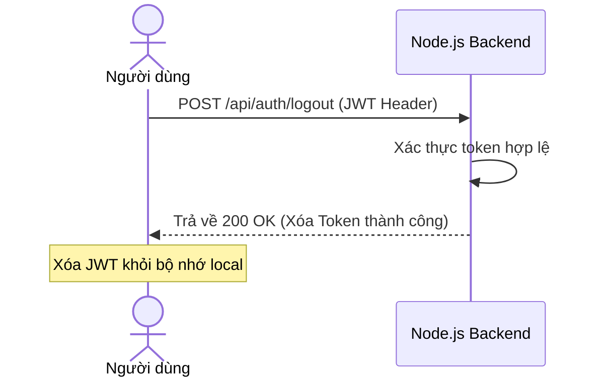

---

## 5. Xác thực JWT (JWT Authentication)

### Mô tả
Middleware kiểm tra tính hợp lệ của JWT gửi kèm trong mỗi request cần bảo mật.

* **Input:** Header `Authorization: Bearer <token>`.
* **Output:** `req.user` chứa dữ liệu người dùng giải mã được, hoặc từ chối request.
* **Quy tắc nghiệp vụ:**
  - Giải mã và kiểm tra hạn dùng của token.
  - Truy vấn database để đảm bảo user đó vẫn tồn tại và vẫn có trạng thái `ACTIVE` (phòng trường hợp tài khoản bị khóa đột xuất).
  - Gán dữ liệu vào `req.user` theo format: `{ id, email, role, status }`.

### Sơ đồ tuần tự (Sequence Diagram)
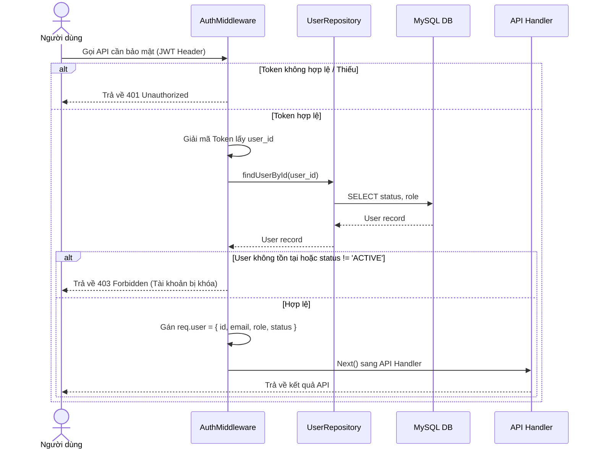

---

## 6. Phân quyền truy cập (Authorization)

### Mô tả
Middleware kiểm tra quyền hạn của người dùng đối với API endpoint.

* **Input:** `req.user.role` (từ Auth Middleware), danh sách các roles được phép truy cập endpoint.
* **Output:** Cho phép xử lý tiếp hoặc trả về lỗi phân quyền.
* **Quy tắc nghiệp vụ:**
  - Nếu `req.user.role` nằm trong danh sách được phép -> đi tiếp.
  - Ngược lại -> Trả lỗi 403 Forbidden (`PERMISSION_DENIED`).

### Sơ đồ tuần tự (Sequence Diagram)
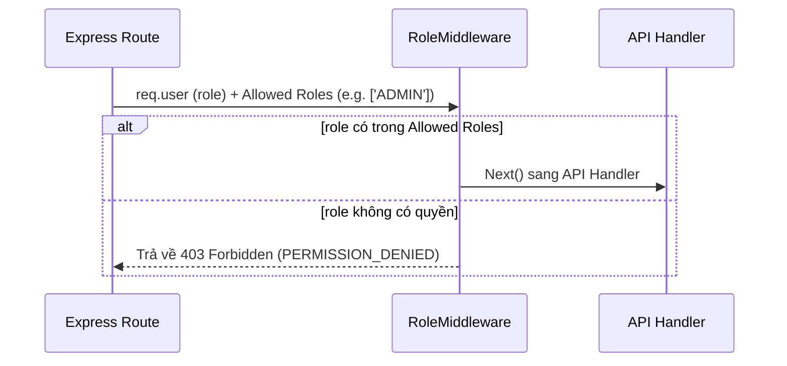

---

## 7. Quên mật khẩu (Forgot Password)

### Mô tả
Yêu cầu cấp lại mật khẩu thông qua Email xác thực.

* **Input:** `email` (string).
* **Output:** Tạo token reset password và gửi email cho người dùng.
* **Quy tắc nghiệp vụ:**
  - Kiểm tra email có tồn tại trong hệ thống.
  - Tạo một mã token ngẫu nhiên, lưu hash vào bảng `auth_tokens` (type `PASSWORD_RESET`), cài đặt thời gian hết hạn (ví dụ: 15 phút).
  - Mô phỏng gửi email chứa liên kết dạng `/reset-password?token=<raw_token>`.

### Sơ đồ tuần tự (Sequence Diagram)
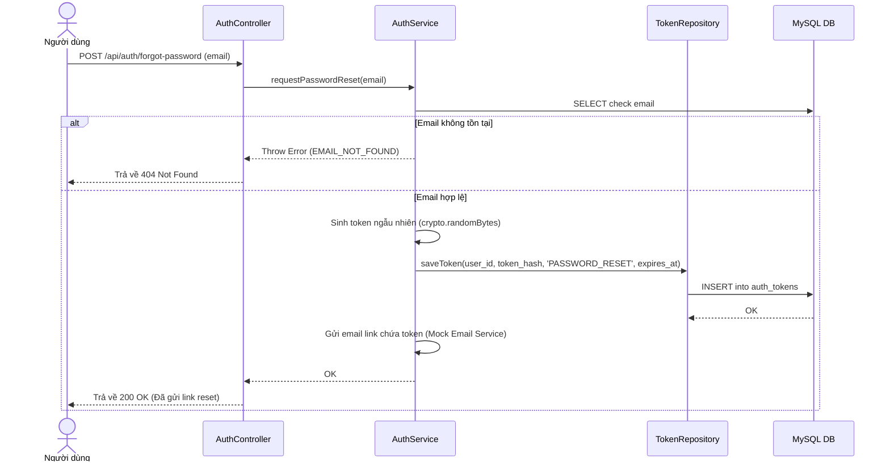

---

## 8. Đặt lại mật khẩu (Reset Password)

### Mô tả
Đặt lại mật khẩu mới sử dụng token được cung cấp từ email.

* **Input:** `token` (string), `newPassword` (string).
* **Output:** Mật khẩu được cập nhật thành công.
* **Quy tắc nghiệp vụ:**
  - Token phải khớp với dữ liệu lưu trong `auth_tokens`, chưa được sử dụng (`used_at IS NULL`) và chưa hết hạn (`expires_at > NOW()`).
  - Hash mật khẩu mới bằng bcrypt, cập nhật cột `password_hash` của user.
  - Đánh dấu token đã được sử dụng (`used_at = NOW()`).

### Sơ đồ tuần tự (Sequence Diagram)
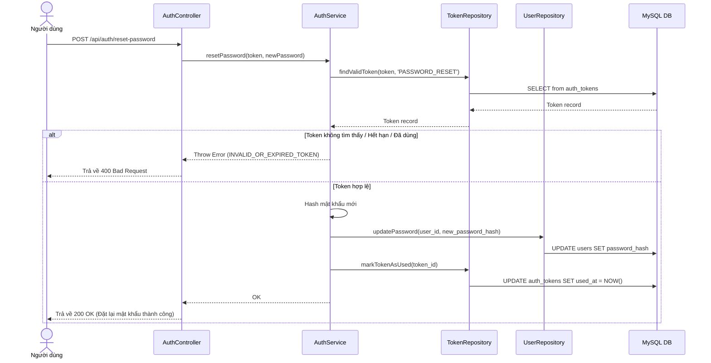

---

## 9. Đổi mật khẩu (Change Password)

### Mô tả
Đổi mật khẩu khi đang đăng nhập hệ thống.

* **Input:** `oldPassword` (string), `newPassword` (string) kèm theo JWT xác thực.
* **Output:** Mật khẩu được cập nhật thành công.
* **Quy tắc nghiệp vụ:**
  - So khớp `oldPassword` với mật khẩu hiện tại trong database.
  - Hash mật khẩu mới và lưu vào bảng `users`.

### Sơ đồ tuần tự (Sequence Diagram)
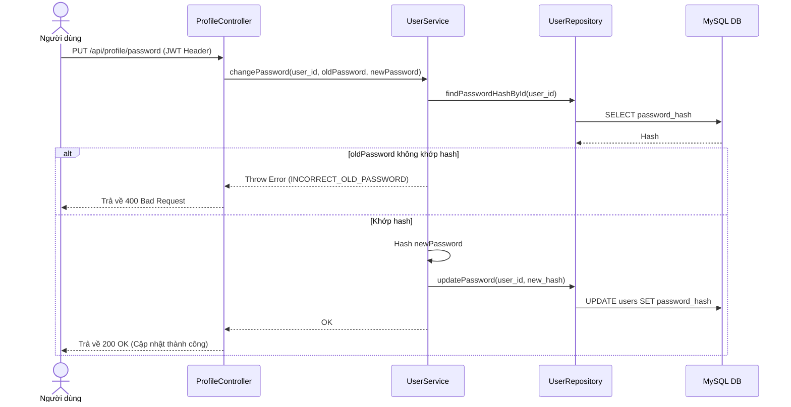

---

## 10. Xem Profile cá nhân (View Profile)

### Mô tả
Xem thông tin chi tiết của tài khoản hiện tại.

* **Input:** JWT Token xác thực.
* **Output:** Thông tin User cơ bản cùng thông tin Profile chi tiết (Sinh viên hoặc Giảng viên).
* **Quy tắc nghiệp vụ:**
  - Dựa vào role của user trong token để LEFT JOIN sang bảng profile tương ứng (`student_profiles` hoặc `teacher_profiles`).

### Sơ đồ tuần tự (Sequence Diagram)
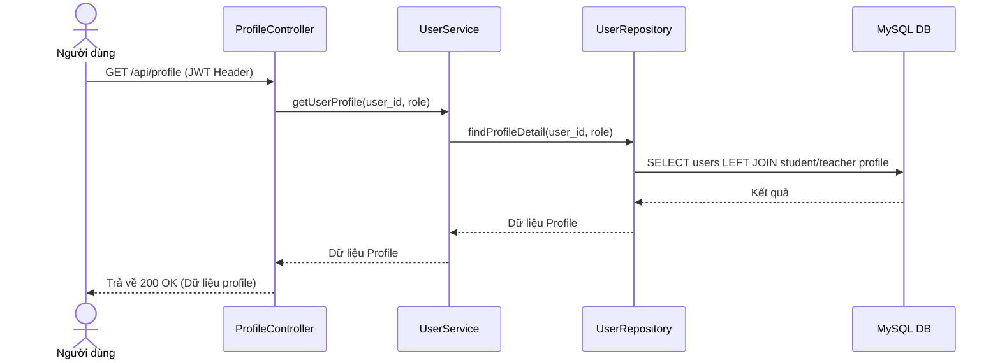

---

## 11. Cập nhật Profile cá nhân (Update Profile)

### Mô tả
Cập nhật các thông tin cá nhân.

* **Input:** `fullName` (string), `phone` (string), `academicTitle` (string, optional - đối với GV), `degree` (string, optional - đối với GV), `department` (string, optional - đối với GV).
* **Output:** Trả về thông tin profile mới nhất.
* **Quy tắc nghiệp vụ:**
  - Sinh viên không được phép sửa mã sinh viên (`student_code`) hay ngày sinh (`date_of_birth`) trong MVP.
  - Giảng viên được phép cập nhật chức danh học hàm, học vị, khoa bộ môn.

### Sơ đồ tuần tự (Sequence Diagram)
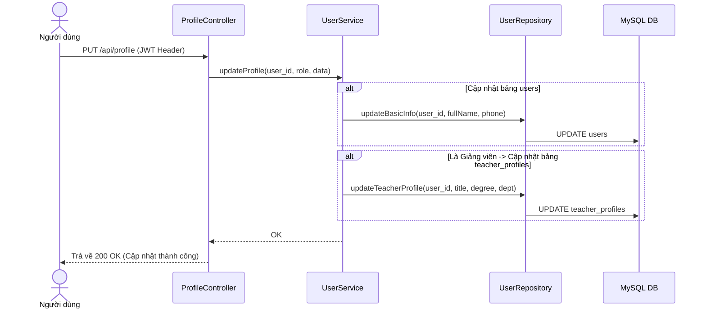

---

## 12. Duyệt giảng viên (Teacher Approval)

### Mô tả
Admin phê duyệt hoặc từ chối đơn đăng ký tài khoản của Giảng viên.

* **Input:** `userId` (int), `status` (string: 'ACTIVE' hoặc 'REJECTED') kèm theo token Admin.
* **Output:** Tài khoản giảng viên được cập nhật trạng thái.
* **Quy tắc nghiệp vụ:**
  - Chỉ Admin mới gọi được API này.
  - Tài khoản đích phải ở trạng thái `PENDING` và có vai trò là `TEACHER`.
  - Cập nhật thêm trường `approved_by` (ID của Admin duyệt) và `approved_at` (thời điểm duyệt).

### Lưu đồ (Flowchart)
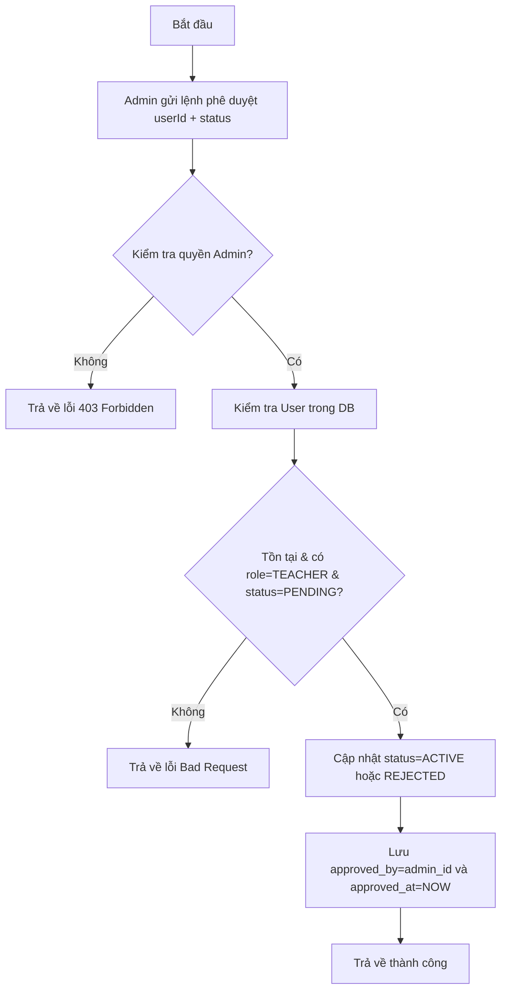

### Sơ đồ tuần tự (Sequence Diagram)
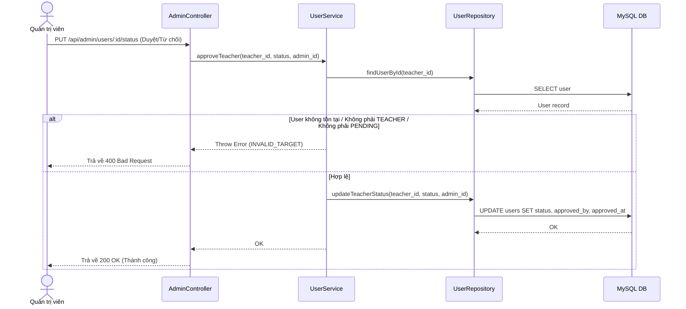

---

## 13. Khóa tài khoản người dùng (Lock User)

### Mô tả
Admin thực hiện khóa tài khoản của người dùng (Sinh viên hoặc Giảng viên).

* **Input:** `userId` (int) của tài khoản cần khóa.
* **Output:** Tài khoản được khóa thành công (`status` = `LOCKED`).
* **Quy tắc nghiệp vụ:**
  - Chỉ Admin mới có quyền gọi.
  - Không thể tự khóa chính mình (Admin tự khóa).
  - Tài khoản sau khi bị khóa sẽ không thể đăng nhập hoặc thực hiện bất kỳ thao tác nào cần JWT xác thực.

### Sơ đồ tuần tự (Sequence Diagram)
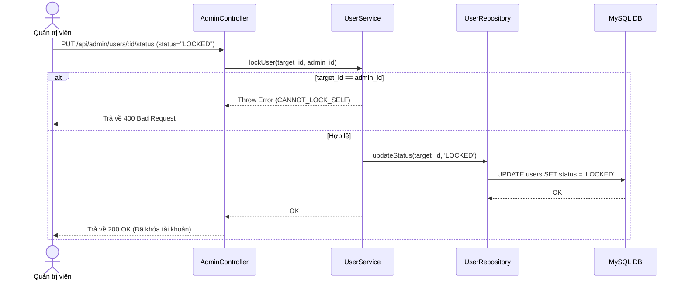

---

## 14. Mở khóa tài khoản người dùng (Unlock User)

### Mô tả
Admin thực hiện mở khóa cho một tài khoản bị khóa trước đó.

* **Input:** `userId` (int) của tài khoản cần mở khóa.
* **Output:** Tài khoản được kích hoạt lại (`status` = `ACTIVE`).
* **Quy tắc nghiệp vụ:**
  - Chỉ Admin mới có quyền gọi.
  - Cập nhật trạng thái tài khoản đích về `ACTIVE`.

### Sơ đồ tuần tự (Sequence Diagram)
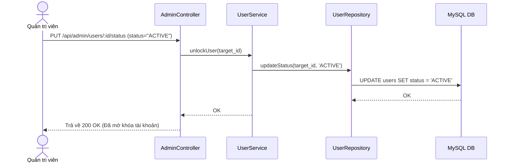

---

## 15. Quản lý danh sách người dùng (CRUD User - Admin perspective)

### Mô tả
Admin xem danh sách, chi tiết, cập nhật thông tin hoặc xóa tài khoản người dùng.

* **Input:** Các query parameters (page, limit, search, role, status).
* **Output:** Danh sách người dùng được lọc và phân trang.
* **Quy tắc nghiệp vụ:**
  - Phân trang chuẩn (trả về `total`, `page`, `limit`, `data`).
  - Hỗ trợ tìm kiếm theo họ tên hoặc email.
  - Hỗ trợ lọc theo `role` (STUDENT/TEACHER) và `status` (PENDING/ACTIVE/LOCKED/REJECTED).
