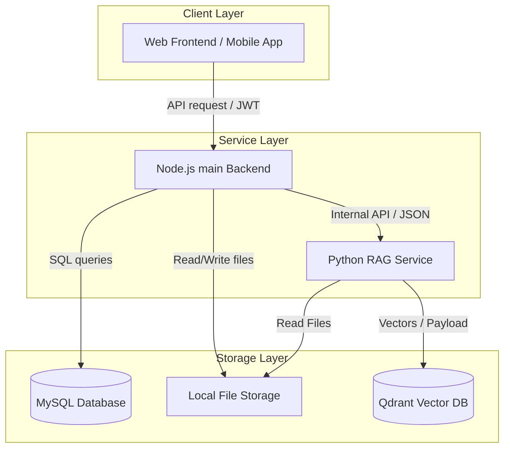
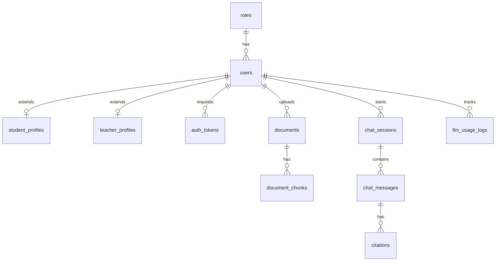
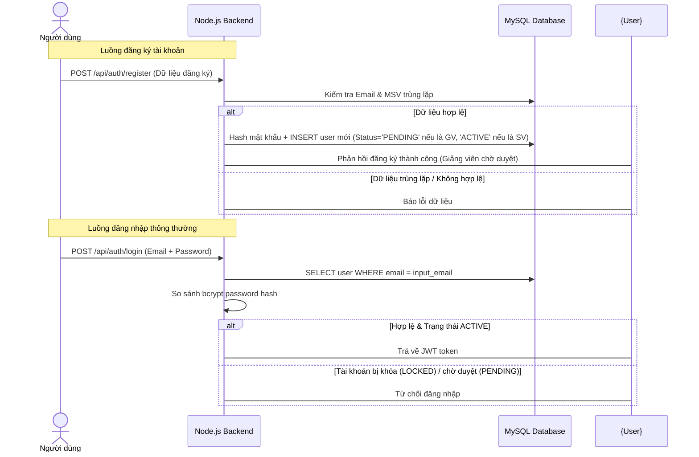
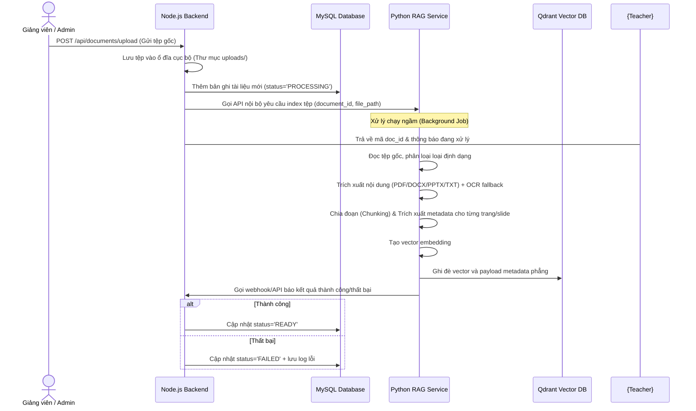
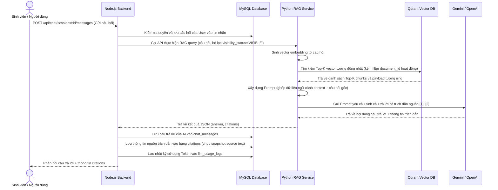

> **Historical draft — superseded by database schema 1.0.0 and current implementation.**
>
> Không dùng schema/API trong file này làm specification. Các phần đã lỗi thời gồm schema/API cũ, `subject_name`, `file_path`, Student Document Management, PPTX trong Week 2, mô tả NodeJS/Qdrant và cascade chat/citation. Tài liệu hiện hành nằm tại `README.md` và `docs/account/README.md`.

# PROJECT DOCUMENTATION - HỆ THỐNG TRỢ LÝ HỌC TẬP RAG (HISTORICAL DRAFT)

Chào mừng bạn đến với tài liệu kỹ thuật chính thức của dự án. Tài liệu này được tổng hợp và hợp nhất từ toàn bộ các tài liệu rời rạc trong hệ thống, đóng vai trò là **Nguồn thông tin duy nhất (Single Source of Truth - SSoT)** cho các thành viên trong đội ngũ phát triển.

---

## Mục lục (Table of Contents)

1. [Giới thiệu dự án](#1-giới-thiệu-dự-án)
   - [Mục tiêu](#mục-tiêu)
   - [Phạm vi](#phạm-vi)
   - [Đối tượng sử dụng](#đối-tượng-sử-dụng)
   - [Bài toán giải quyết](#bài-toán-giải-quyết)
2. [Kiến trúc hệ thống](#2-kiến-trúc-hệ-thống)
   - [Tổng quan](#tổng-quan)
   - [Kiến trúc Backend](#kiến-trúc-backend)
   - [Kiến trúc Frontend & Mobile](#kiến-trúc-frontend--mobile)
   - [Kiến trúc AI/RAG](#kiến-trúc-airag)
3. [Tech Stack](#3-tech-stack)
4. [Các module của hệ thống](#4-các-module-của-hệ-thống)
5. [Thiết kế Database](#5-thiết-kế-database)
   - [Danh sách bảng](#danh-sách-bảng)
   - [Chi tiết các bảng và Quan hệ](#chi-tiết-các-bảng-và-quan-he)
   - [Phục vụ RAG như thế nào](#phục-vụ-rag-như-thế-nào)
6. [Thiết kế API](#6-thiết-kế-api)
7. [Các luồng xử lý chính (Workflows)](#7-các-luồng-xử-lý-chính-workflows)
8. [Luồng xử lý tài liệu (Document Pipeline)](#8-luồng-xử-lý-tài-liệu-document-pipeline)
9. [Quy tắc Metadata](#9-quy-tắc-metadata)
10. [Quy tắc RAG](#10-quy-tắc-rag)
11. [MVP Scope Checklist](#11-mvp-scope-checklist)
12. [Quy ước Coding](#12-quy-ước-coding)
13. [Quyết định kỹ thuật (Technical Decisions)](#13-quyết-định-kỹ-thuật-technical-decisions)
14. [Những điểm còn thiếu và Rủi ro](#14-những-điểm-còn-thiếu-và-rủi-ro)
15. [Phụ lục A: Tóm tắt mâu thuẫn và thống nhất (Conflict Summary)](#phụ-lục-a-tóm-tắt-mâu-thuẫn-và-thống-nhất-conflict-summary)
16. [Phụ lục B: Future Work](#phụ-lục-b-future-work)

---

## 1. Giới thiệu dự án

### Mục tiêu
Xây dựng một hệ thống trợ lý ảo hỗ trợ học tập thông minh dựa trên công nghệ RAG (Retrieval-Augmented Generation). Hệ thống cho phép lưu trữ tài liệu học tập, phân tích và trả lời câu hỏi của người học một cách chính xác dựa trên nguồn tài liệu đáng tin cậy do giảng viên và quản trị viên tải lên, kèm theo các trích dẫn (citations) nguồn gốc cụ thể (số trang, tên slide, đoạn văn bản nguồn).

### Phạm vi
Hệ thống được phát triển dưới dạng ứng dụng Web và Mobile (Android/iOS) cho người dùng cuối (Sinh viên, Giảng viên), cùng cổng quản trị trực quan dành cho Quản trị viên (Admin). Phiên bản hiện tại tập trung hoàn thiện phiên bản sản phẩm khả thi tối thiểu (MVP) trong vòng 7 tuần.

### Đối tượng sử dụng
* **Sinh viên (STUDENT):** Đặt câu hỏi, nhận câu trả lời hỗ trợ học tập, tra cứu lịch sử chat và kiểm chứng nguồn gốc tài liệu qua trích dẫn.
* **Giảng viên (TEACHER):** Đăng tải, quản lý và tổ chức các tài liệu học tập (bài giảng, giáo trình) theo môn học phụ trách.
* **Quản trị viên (ADMIN):** Quản lý người dùng (duyệt giảng viên, khóa/mở tài khoản), quản lý toàn bộ tài liệu hệ thống và theo dõi hiệu năng sử dụng (dashboard).

### Bài toán giải quyết
* **Tự động hóa hỗ trợ học tập:** Giải đáp thắc mắc của sinh viên 24/7 tức thời.
* **Ngăn chặn hiện tượng ảo giác (Hallucination) của LLM:** Buộc câu trả lời phải bám sát nội dung tài liệu học tập thực tế và có cơ chế cảnh báo độ tin cậy.
* **Xác thực nguồn tin cậy:** Trích dẫn chính xác vị trí tài liệu gốc (số trang PDF, slide PPTX, tiêu đề DOCX) giúp người học dễ dàng đối chiếu và đào sâu kiến thức.

---

## 2. Kiến trúc hệ thống

### Tổng quan
Hệ thống được thiết kế theo mô hình Microservices phân tách rõ ràng giữa nghiệp vụ quản lý (Business & Operations) và nghiệp vụ AI/RAG.



### Kiến trúc Backend
* **Node.js (Express + JavaScript):** Đóng vai trò là API Gateway và ứng dụng nghiệp vụ chính. Quản lý xác thực người dùng, phân quyền, quản lý metadata tài liệu, lưu trữ lịch sử trò chuyện và giám sát mức độ sử dụng LLM.
* **Python (LlamaIndex):** Đóng vai trò là dịch vụ chuyên trách RAG. Nhận yêu cầu phân tích tài liệu từ Node.js, thực hiện parse, OCR, chia chunk, tạo embedding và lưu trữ vào Qdrant. Khi nhận câu hỏi, dịch vụ này chịu trách nhiệm tìm kiếm ngữ cảnh (retrieval) và giao tiếp với LLM để sinh câu trả lời kèm trích dẫn.

### Kiến trúc Frontend & Mobile
* Giao diện người dùng được thiết kế responsive trên Web và tối ưu trên ứng dụng di động Mobile App.
* Tích hợp bộ đọc tài liệu (PDF Viewer / Slide Viewer) để khi người dùng click vào trích dẫn (citation), màn hình sẽ tự động mở đúng trang/slide và highlight văn bản nguồn tương ứng.

### Kiến trúc AI/RAG
* Áp dụng quy trình RAG chuẩn hóa: Ingestion (Offline Pipeline) và Retrieval + Generation (Online Query).
* Sử dụng LlamaIndex làm framework điều phối chính để tận dụng thế mạnh quản lý cấu trúc các Node (source_nodes) và trích xuất thông tin nguồn.

---

## 3. Tech Stack

| Thành phần | Công nghệ lựa chọn | Ghi chú |
| :--- | :--- | :--- |
| **Backend Core** | Node.js (Express) | Dùng JavaScript thuần (ES6+), không dùng TypeScript. |
| **Database Gateway** | `mysql2/promise` | Kết nối MySQL trực tiếp bằng Parameterized SQL. **Không dùng ORM**. |
| **AI/RAG Service** | Python (LlamaIndex) | Framework tối ưu cho trích dẫn (citation tracking). |
| **Relational Database** | MySQL | Lưu trữ dữ liệu nghiệp vụ, metadata tài liệu, phiên chat và logs. |
| **Vector Database** | Qdrant | Vector DB chính thức chạy trên Docker. (Milvus làm backup mở rộng). |
| **AI / LLM** | Gemini / OpenAI APIs | Gemini làm LLM chính, OpenAI (GPT-4o-mini) làm backup. |
| **Embedding Model** | Gemini Embedding 001 / OpenAI text-embedding-3-small | Gemini làm chính. OpenAI hoặc BGE-M3 (local) làm baseline thử nghiệm. |
| **PDF Parser** | PyMuPDF | Thư viện chính, tốc độ nhanh và hỗ trợ lấy tọa độ bbox. |
| **DOCX Parser** | python-docx | Hỗ trợ lấy paragraph, table và style headings. |
| **PPTX Parser** | python-pptx | Duyệt theo slide và shapes chứa text. |
| **OCR Fallback** | OCRmyPDF + Tesseract | Tích hợp ngôn ngữ `eng+vie`. Chỉ kích hoạt khi text gốc rỗng hoặc quá ít. |
| **File Storage** | Local File Storage | Lưu trữ tệp tin gốc tải lên trong thư mục `uploads/` trên server. |
| **Containerization** | Docker / Docker Compose | Container hóa MySQL và Qdrant phục vụ môi trường chạy thử. |

---

## 4. Các module của hệ thống

### 4.1. Auth & Profile Module
* **Mô tả:** Đảm nhận việc đăng ký, đăng nhập và bảo mật tài khoản người dùng.
* **Chức năng:** Đăng ký sinh viên/giảng viên, Đăng nhập nhận mã JWT, Đổi mật khẩu, Cập nhật thông tin cá nhân. Đối với Admin, hỗ trợ đăng nhập qua tài khoản seed mặc định kết hợp mã OTP gửi qua Email.
* **Workflow:** Người dùng gửi thông tin -> Hệ thống kiểm tra hợp lệ -> Lưu DB -> Trả về JWT.
* **Database liên quan:** `users`, `student_profiles`, `teacher_profiles`, `auth_tokens`, `roles`.
* **API liên quan:** `/api/auth/*`, `/api/profile/*`.
* **Trạng thái:** MVP (Bắt buộc).

### 4.2. Account Management Module
* **Mô tả:** Dành cho Admin để quản lý trạng thái tài khoản toàn hệ thống.
* **Chức năng:** Xem danh sách tài khoản, phê duyệt hoặc từ chối đơn đăng ký của Giảng viên (`PENDING` -> `ACTIVE` / `REJECTED`), khóa hoặc mở khóa tài khoản người dùng (`ACTIVE` <-> `LOCKED`).
* **Database liên quan:** `users`.
* **API liên quan:** `/api/admin/users/*`.
* **Trạng thái:** MVP (Bắt buộc).

### 4.3. Document Management Module
* **Mô tả:** Phục vụ Giảng viên và Admin quản trị kho ngữ liệu học tập.
* **Chức năng:** Tải lên tài liệu, xem danh sách tài liệu cá nhân hoặc toàn bộ, ẩn tài liệu (không tham gia vào RAG nhưng không xóa khỏi DB), xóa tài liệu (xóa logic khỏi MySQL và xóa vector khỏi Qdrant).
* **Database liên quan:** `documents`, `document_chunks`.
* **API liên quan:** `/api/documents/*`.
* **Trạng thái:** MVP (Bắt buộc).

### 4.4. Chat Module
* **Mô tả:** Giao diện tương tác chính giữa Sinh viên/Giảng viên với AI Trợ lý học tập.
* **Chức năng:** Tạo phiên chat mới, gửi câu hỏi, lưu và lấy lịch sử hội thoại của từng phiên.
* **Database liên quan:** `chat_sessions`, `chat_messages`, `citations`.
* **API liên quan:** `/api/chat/*`.
* **Trạng thái:** MVP (Bắt buộc).

### 4.5. Citation & Source Module
* **Mô tả:** Cung cấp minh chứng cho câu trả lời của AI.
* **Chức năng:** Trả về danh sách nguồn dữ liệu gốc của một câu trả lời (Tên file, Số trang PDF, Số slide PPTX, Tiêu đề chương DOCX, đoạn văn bản nguồn). Hỗ trợ Frontend hiển thị chính xác trang và đoạn văn cần highlight.
* **Database liên quan:** `citations`.
* **API liên quan:** `/api/citations/*`.
* **Trạng thái:** MVP (Bắt buộc hiển thị văn bản và số trang; highlight nâng cao thuộc phạm vi tương lai).

### 4.6. RAG Integration Module
* **Mô tả:** Luồng giao tiếp nội bộ giữa Node.js backend và Python RAG service.
* **Chức năng:** NodeJS gửi lệnh yêu cầu Python xử lý index tài liệu mới và gửi câu hỏi để nhận câu trả lời cùng thông tin citation.
* **API liên quan:** Các API nội bộ giữa 2 service (không expose ra ngoài).
* **Trạng thái:** MVP (Bắt buộc).

### 4.7. Admin Dashboard & Usage Module
* **Mô tả:** Báo cáo hoạt động hệ thống tối giản cho Admin.
* **Chức năng:** Xem thống kê lượng tài liệu, số lượng người dùng hoạt động, theo dõi nhật ký sử dụng token LLM và chi phí ước tính.
* **Database liên quan:** `llm_usage_logs`.
* **API liên quan:** `/api/admin/dashboard`.
* **Trạng thái:** MVP (Hỗ trợ mức tối thiểu).

---

## 5. Thiết kế Database

### Danh sách bảng
Hệ thống sử dụng cơ sở dữ liệu quan hệ MySQL với quy ước đặt tên dạng **snake_case**.



### Chi tiết các bảng và Quan hệ

#### Bảng `roles`
*Lưu danh sách quyền hạn mặc định.*
```sql
CREATE TABLE roles (
  id INT AUTO_INCREMENT PRIMARY KEY,
  code VARCHAR(50) UNIQUE NOT NULL, -- 'STUDENT', 'TEACHER', 'ADMIN'
  name VARCHAR(100) NOT NULL,
  description VARCHAR(255) NULL
);
```

#### Bảng `users`
*Lưu thông tin tài khoản cơ bản.*
```sql
CREATE TABLE users (
  id INT AUTO_INCREMENT PRIMARY KEY,
  role_id INT NOT NULL,
  full_name VARCHAR(255) NOT NULL,
  email VARCHAR(255) UNIQUE NOT NULL,
  password_hash VARCHAR(255) NOT NULL,
  phone VARCHAR(20) NULL,
  status VARCHAR(50) NOT NULL DEFAULT 'PENDING', -- 'PENDING', 'ACTIVE', 'LOCKED', 'REJECTED'
  email_verified_at TIMESTAMP NULL,
  approved_by INT NULL, -- FK to users(id) (Admin duyệt)
  approved_at TIMESTAMP NULL,
  created_at TIMESTAMP DEFAULT CURRENT_TIMESTAMP,
  updated_at TIMESTAMP DEFAULT CURRENT_TIMESTAMP ON UPDATE CURRENT_TIMESTAMP,
  FOREIGN KEY (role_id) REFERENCES roles(id),
  FOREIGN KEY (approved_by) REFERENCES users(id)
);
```

#### Bảng `student_profiles`
*Thông tin chi tiết của sinh viên.*
```sql
CREATE TABLE student_profiles (
  user_id INT PRIMARY KEY,
  student_code VARCHAR(50) UNIQUE NOT NULL, -- MSV (Không cho sửa sau đăng ký)
  date_of_birth DATE NOT NULL,
  created_at TIMESTAMP DEFAULT CURRENT_TIMESTAMP,
  updated_at TIMESTAMP DEFAULT CURRENT_TIMESTAMP ON UPDATE CURRENT_TIMESTAMP,
  FOREIGN KEY (user_id) REFERENCES users(id) ON DELETE CASCADE
);
```

#### Bảng `teacher_profiles`
*Thông tin chi tiết của giảng viên.*
```sql
CREATE TABLE teacher_profiles (
  user_id INT PRIMARY KEY,
  academic_title VARCHAR(100) NULL, -- Học hàm (Phó giáo sư, Giáo sư,...)
  degree VARCHAR(100) NULL,         -- Học vị (Thạc sĩ, Tiến sĩ,...)
  department VARCHAR(255) NULL,     -- Khoa/Bộ môn
  created_at TIMESTAMP DEFAULT CURRENT_TIMESTAMP,
  updated_at TIMESTAMP DEFAULT CURRENT_TIMESTAMP ON UPDATE CURRENT_TIMESTAMP,
  FOREIGN KEY (user_id) REFERENCES users(id) ON DELETE CASCADE
);
```

#### Bảng `auth_tokens`
*Lưu trữ các mã token bảo mật (reset pass, admin OTP, xác thực email).*
```sql
CREATE TABLE auth_tokens (
  id INT AUTO_INCREMENT PRIMARY KEY,
  user_id INT NOT NULL,
  type VARCHAR(50) NOT NULL, -- 'PASSWORD_RESET', 'ADMIN_OTP', 'EMAIL_VERIFY'
  token_hash VARCHAR(255) NOT NULL,
  expires_at TIMESTAMP NOT NULL,
  used_at TIMESTAMP NULL,
  created_at TIMESTAMP DEFAULT CURRENT_TIMESTAMP,
  FOREIGN KEY (user_id) REFERENCES users(id) ON DELETE CASCADE
);
```

#### Bảng `documents`
*Quản lý danh mục tài liệu được tải lên.*
```sql
CREATE TABLE documents (
  id INT AUTO_INCREMENT PRIMARY KEY,
  uploaded_by INT NOT NULL,
  title VARCHAR(255) NOT NULL,
  original_file_name VARCHAR(255) NOT NULL,
  file_type VARCHAR(50) NOT NULL, -- 'TXT', 'DOCX', 'PDF', 'PPTX'
  file_path VARCHAR(555) NOT NULL,
  subject_name VARCHAR(255) NULL, -- Tên môn học (lưu tạm thời cho MVP)
  processing_status VARCHAR(50) NOT NULL DEFAULT 'UPLOADED', -- 'UPLOADED', 'PROCESSING', 'READY', 'FAILED'
  visibility_status VARCHAR(50) NOT NULL DEFAULT 'VISIBLE', -- 'VISIBLE', 'HIDDEN', 'DELETED'
  processing_error TEXT NULL,
  metadata JSON NULL, -- Metadata mở rộng dạng JSON phẳng
  created_at TIMESTAMP DEFAULT CURRENT_TIMESTAMP,
  updated_at TIMESTAMP DEFAULT CURRENT_TIMESTAMP ON UPDATE CURRENT_TIMESTAMP,
  FOREIGN KEY (uploaded_by) REFERENCES users(id)
);
```

#### Bảng `document_chunks`
*Bảng bổ trợ trong MySQL giúp quản lý, đối chiếu và audit dữ liệu chunk nhanh chóng mà không cần query liên tục vào Qdrant.*
```sql
CREATE TABLE document_chunks (
  id INT AUTO_INCREMENT PRIMARY KEY,
  document_id INT NOT NULL,
  chunk_index INT NOT NULL,
  chunk_id VARCHAR(255) NOT NULL, -- Trùng với ID vector lưu trong Qdrant
  source_text TEXT NOT NULL,
  created_at TIMESTAMP DEFAULT CURRENT_TIMESTAMP,
  FOREIGN KEY (document_id) REFERENCES documents(id) ON DELETE CASCADE
);
```

#### Bảng `chat_sessions`
*Quản lý các phiên hội thoại của người học.*
```sql
CREATE TABLE chat_sessions (
  id INT AUTO_INCREMENT PRIMARY KEY,
  user_id INT NOT NULL,
  title VARCHAR(255) NOT NULL DEFAULT 'Cuộc trò chuyện mới',
  created_at TIMESTAMP DEFAULT CURRENT_TIMESTAMP,
  updated_at TIMESTAMP DEFAULT CURRENT_TIMESTAMP ON UPDATE CURRENT_TIMESTAMP,
  FOREIGN KEY (user_id) REFERENCES users(id) ON DELETE CASCADE
);
```

#### Bảng `chat_messages`
*Chi tiết các tin nhắn trong phiên hội thoại.*
```sql
CREATE TABLE chat_messages (
  id INT AUTO_INCREMENT PRIMARY KEY,
  session_id INT NOT NULL,
  sender VARCHAR(50) NOT NULL, -- 'USER', 'ASSISTANT'
  message_text TEXT NOT NULL,
  created_at TIMESTAMP DEFAULT CURRENT_TIMESTAMP,
  FOREIGN KEY (session_id) REFERENCES chat_sessions(id) ON DELETE CASCADE
);
```

#### Bảng `citations`
*Bản lưu trữ thông tin trích dẫn nguồn dữ liệu của từng câu trả lời. Bắt buộc chụp lại ảnh chụp văn bản nguồn (source_text_snapshot) phòng trường hợp tài liệu gốc bị cập nhật/xóa thì lịch sử chat cũ vẫn hiển thị chính xác nguồn trích dẫn.*
```sql
CREATE TABLE citations (
  id INT AUTO_INCREMENT PRIMARY KEY,
  message_id INT NOT NULL,
  document_id INT NULL, -- Nhận NULL nếu tài liệu gốc bị xóa khỏi hệ thống
  document_title VARCHAR(255) NOT NULL,
  page_number INT NULL, -- Đối với PDF
  slide_number INT NULL, -- Đối với PPTX
  source_text_snapshot TEXT NOT NULL,
  chunk_id VARCHAR(255) NULL,
  created_at TIMESTAMP DEFAULT CURRENT_TIMESTAMP,
  FOREIGN KEY (message_id) REFERENCES chat_messages(id) ON DELETE CASCADE,
  FOREIGN KEY (document_id) REFERENCES documents(id) ON DELETE SET NULL
);
```

#### Bảng `llm_usage_logs`
*Lưu lịch sử gọi LLM phục vụ thống kê FinOps và tối ưu hóa hệ thống.*
```sql
CREATE TABLE llm_usage_logs (
  id INT AUTO_INCREMENT PRIMARY KEY,
  user_id INT NOT NULL,
  message_id INT NULL,
  provider VARCHAR(100) NOT NULL, -- 'GEMINI', 'OPENAI', 'LOCAL'
  model VARCHAR(100) NOT NULL,
  prompt_tokens INT NOT NULL,
  completion_tokens INT NOT NULL,
  total_tokens INT NOT NULL,
  estimated_cost DECIMAL(10, 6) DEFAULT 0.000000,
  latency_ms INT NOT NULL,
  created_at TIMESTAMP DEFAULT CURRENT_TIMESTAMP,
  FOREIGN KEY (user_id) REFERENCES users(id),
  FOREIGN KEY (message_id) REFERENCES chat_messages(id) ON DELETE SET NULL
);
```

### Phục vụ RAG như thế nào
* **Tìm kiếm nhanh chóng:** Qdrant lưu trữ vector để tìm kiếm ngữ nghĩa (semantic search). `document_chunks` trong MySQL hỗ trợ tìm nhanh text thô dựa trên ID vector.
* **Lọc tài liệu chính xác:** Nhờ lưu cấu trúc phẳng (flat payload) trên Qdrant bao gồm `document_id` và `visibility_status`, hệ thống có thể áp dụng các bộ lọc (filter) để loại bỏ các tài liệu ẩn (`HIDDEN`) hoặc đã xóa (`DELETED`) ra khỏi kết quả trước khi đưa vào LLM.
* **Traceback citation hiệu quả:** Khi LLM sinh ra trích dẫn, hệ thống chỉ cần map mã vector ID hoặc `chunk_id` sang bảng `citations` để trả về đầy đủ các trường `page_number`, `slide_number`, `document_title` cho client hiển thị.

---

## 6. Thiết kế API

Tất cả các API nghiệp vụ đều có tiền tố `/api` và trả về định dạng JSON thống nhất.

### Tài liệu API & Tích hợp Postman (Swagger / OpenAPI 3.0)
* **Swagger UI:** `http://localhost:5000/api-docs` (Giao diện Web trực quan để xem cấu trúc Request/Response và test trực tiếp các API).
* **OpenAPI JSON Spec:** `http://localhost:5000/api-docs.json` (Dùng để import trực tiếp vào Postman thông qua chức năng: `Import` -> `Link` -> Dán link này -> `Continue` -> `Import`).
* **Hỗ trợ Authorize:** Nhập JWT token lấy từ API `/api/auth/login` vào mục `Authorize 🔒` (Bearer Token) trên Swagger UI để tự động gửi kèm token xác thực trong mọi request thử nghiệm.

### Quy chuẩn Response chung

#### Thành công:
```json
{
  "success": true,
  "message": "OK",
  "data": {}
}
```

#### Thất bại:
```json
{
  "success": false,
  "message": "Chi tiết thông báo lỗi cho người dùng",
  "errorCode": "MÃ_LỖI_HỆ_THỐNG"
}
```

---

### Danh sách các API Endpoint nghiệp vụ

| Nhóm chức năng | Endpoint | Method | Request Body (Mẫu) | Quyền truy cập |
| :--- | :--- | :--- | :--- | :--- |
| **Xác thực** | `/api/auth/register` | POST | `{"email": "...", "password": "...", "fullName": "...", "role": "STUDENT", "studentCode": "SV01", "dateOfBirth": "2005-01-01"}` | Public |
| | `/api/auth/login` | POST | `{"email": "...", "password": "..."}` | Public |
| | `/api/auth/admin/verify-otp` | POST | `{"email": "...", "otpCode": "..."}` | Public (Dành cho Admin đăng nhập) |
| | `/api/auth/forgot-password` | POST | `{"email": "..."}` | Public |
| | `/api/auth/reset-password` | POST | `{"token": "...", "newPassword": "..."}` | Public |
| **Profile** | `/api/profile` | GET | *None* | STUDENT, TEACHER, ADMIN |
| | `/api/profile` | PUT | `{"fullName": "...", "phone": "..."}` | STUDENT, TEACHER, ADMIN |
| | `/api/profile/password` | PUT | `{"oldPassword": "...", "newPassword": "..."}` | STUDENT, TEACHER, ADMIN |
| **Quản lý User** | `/api/admin/users` | GET | *None* (Có query lọc role, status) | ADMIN |
| | `/api/admin/users/:id/status` | PUT | `{"status": "ACTIVE"}` | ADMIN (Duyệt, khóa, mở tài khoản) |
| **Quản lý Tài liệu** | `/api/documents/upload` | POST | Form-data: `file` (PDF/TXT/DOCX/PPTX) | TEACHER, ADMIN |
| | `/api/documents` | GET | *None* | STUDENT (chỉ xem VISIBLE), TEACHER (của mình), ADMIN (tất cả) |
| | `/api/documents/:id` | GET | *None* | STUDENT, TEACHER, ADMIN |
| | `/api/documents/:id/visibility` | PUT | `{"visibilityStatus": "HIDDEN"}` | TEACHER (của mình), ADMIN |
| | `/api/documents/:id` | DELETE | *None* (Xóa logic & xóa vector) | TEACHER (của mình), ADMIN |
| **Trò chuyện AI** | `/api/chat/sessions` | POST | `{"title": "Học máy cơ bản"}` | STUDENT, TEACHER, ADMIN |
| | `/api/chat/sessions` | GET | *None* | STUDENT, TEACHER, ADMIN |
| | `/api/chat/sessions/:id/messages`| POST | `{"messageText": "Học máy có giám sát là gì?"}`| STUDENT, TEACHER, ADMIN |
| | `/api/chat/sessions/:id/messages`| GET | *None* | STUDENT, TEACHER, ADMIN |
| | `/api/chat/sessions/:id` | DELETE | *None* | STUDENT, TEACHER, ADMIN |
| **Trích dẫn** | `/api/citations/:message_id`| GET | *None* | STUDENT, TEACHER, ADMIN |
| **Dashboard** | `/api/admin/dashboard` | GET | *None* | ADMIN |

---

## 7. Các luồng xử lý chính (Workflows)

### 7.1. Đăng ký & Đăng nhập tài khoản



### 7.2. Luồng xử lý tài liệu tải lên



### 7.3. Luồng hỏi đáp RAG & citation



---

## 8. Luồng xử lý tài liệu (Document Pipeline)

Quy trình nhập dữ liệu (Ingestion Pipeline) được thực hiện hoàn toàn phía Python RAG service để đảm bảo hiệu năng và khả năng xử lý song song.

1. **Upload:** Backend Node.js tiếp nhận file qua thư viện upload (như `multer`), lưu trữ file thô trên local storage tại folder chỉ định (`uploads/`), và ghi nhận metadata ban đầu vào MySQL.
2. **Validate:** Kiểm tra định dạng file tải lên (chỉ chấp nhận `.pdf`, `.docx`, `.pptx`, `.txt`).
3. **Parse (Trích xuất):**
   * **PDF:** Sử dụng **PyMuPDF** làm parser chính để trích xuất text của từng trang một. Sử dụng `pdfplumber` làm backup khi phân tích các tài liệu có cấu trúc bảng biểu hoặc định dạng cột phức tạp.
   * **DOCX:** Sử dụng `python-docx` để duyệt qua từng paragraph, run và table.
   * **PPTX:** Sử dụng `python-pptx` để duyệt các shape chứa văn bản trong từng slide.
   * **TXT:** Sử dụng cơ chế đọc tệp tin mặc định của Python với encoding UTF-8.
4. **OCR Fallback:** Khi quá trình trích xuất văn bản thô (native text) trả về độ dài ký tự quá thấp hoặc bằng không (file PDF dạng quét ảnh), hệ thống tự động kích hoạt **OCRmyPDF + Tesseract** để số hóa tài liệu thành searchable PDF trước khi parse lại.
5. **Chunking (Chia đoạn):**
   * **Quy tắc chung:** Chia đoạn có sự hiểu biết về ngữ cảnh văn bản (structure-aware split) thay vì chia cơ học theo ký tự để tránh mất nghĩa từ ghép tiếng Việt.
   * **PDF:** Bắt buộc chia nhỏ văn bản trong phạm vi từng trang riêng biệt. **Nghiêm cấm chia chunk vượt qua ranh giới trang (no cross-page)** để đảm bảo số trang trích dẫn hoàn toàn chính xác.
   * **PPTX:** Chia chunk theo từng slide một (slide-aware).
   * **DOCX/TXT:** Chia chunk theo cấu trúc các heading và paragraph.
6. **Metadata Extraction:** Tự động đính kèm thông tin vị trí xuất xứ (tên file, số trang, số slide, hash nội dung) vào từng chunk.
7. **Embedding Generation:** Gửi nội dung từng chunk đến API Embedding (mặc định là Gemini Embedding 001) để lấy vector đặc trưng.
8. **Qdrant Indexing:** Đẩy vector kèm payload metadata phẳng lên Qdrant Vector DB để đánh chỉ mục.

---

## 9. Quy tắc Metadata

Mỗi chunk dữ liệu được lưu trữ dưới dạng một điểm vector trên Qdrant Vector DB bắt buộc phải đi kèm thông tin Metadata dạng cấu trúc **phẳng (flat payload)**. Cấu trúc phẳng giúp giảm thiểu tối đa tài nguyên xử lý và tối ưu tốc độ lọc tìm kiếm (metadata filtering) trên Qdrant.

| Tên trường (Key) | Kiểu dữ liệu | Ý nghĩa |
| :--- | :--- | :--- |
| `document_id` | `string` | ID đại diện cho tài liệu trong MySQL. |
| `document_version` | `int` | Phiên bản tài liệu (hỗ trợ re-indexing không gây trùng lặp). |
| `file_name` | `string` | Tên tệp tin gốc. |
| `file_type` | `string` | Định dạng tệp (`pdf`, `docx`, `txt`, `pptx`). |
| `page_number` | `int` / `null` | Số trang chứa chunk văn bản (Bắt buộc với PDF). |
| `slide_number` | `int` / `null` | Số slide chứa chunk văn bản (Bắt buộc với PPTX). |
| `chunk_id` | `string` | ID định danh duy nhất cho chunk (Khớp khóa chính MySQL). |
| `chunk_index` | `int` | Vị trí thứ tự của chunk trong toàn bộ tài liệu. |
| `section_title` | `string` / `null` | Tên đề mục chứa chunk văn bản (dành cho DOCX/PDF nếu parse được). |
| `source_text` | `string` | Đoạn văn bản thô dùng để RAG và hiển thị citation. |
| `language` | `string` | Ngôn ngữ được phát hiện (`vi`, `en`, `vi-en`). |
| `upload_time` | `string` | Định dạng thời gian chuẩn ISO 8601. |
| `storage_path` | `string` | Đường dẫn vật lý đến file gốc trên server backend. |
| `hash` | `string` | MD5 hash của chunk text giúp phát hiện trùng lặp nội dung. |
| `bbox` | `json` / `null` | Tọa độ khối văn bản trên trang PDF (Dành cho việc highlight nâng cao sau này). |

---

## 10. Quy tắc RAG

Để đảm bảo kết quả truy xuất tốt nhất cho môi trường học thuật, các tham số cấu hình RAG cần tuân thủ cấu hình chuẩn hóa sau:

### 10.1. Cấu hình Ingestion
* **Chunk size:** Dao động từ **500–800 tokens** (áp dụng cho tài liệu thông thường) nhằm lưu giữ đầy đủ ngữ cảnh lý thuyết khoa học. Đối với tài liệu cấu trúc văn bản đặc biệt ngắn hoặc cô đọng, có thể giảm xuống **300–500 tokens**.
* **Chunk overlap:** Thiết lập từ **80–120 tokens** (hoặc **50–100 tokens** đối với chunk size nhỏ) để đảm bảo không bị đứt gãy thông tin giữa các đoạn nối tiếp.
* **Vietnamese Tokenization:** Khuyên khích sử dụng bộ cắt từ chuyên dụng như `underthesea` hoặc `pyvi` ở bước tiền xử lý nhằm xác định ranh giới từ ghép tiếng Việt chính xác trước khi tính toán số token.

### 10.2. Cấu hình Retrieval
* **Top-K (Số lượng ngữ cảnh lấy ra):** Lấy **Top-3 đến Top-5** chunks có điểm tương đồng cao nhất đưa vào prompt ngữ cảnh của LLM.
* **Similarity Threshold (Ngưỡng tương đồng):** Đặt ngưỡng tối thiểu là **0.70** (cho dense cosine similarity). Bất kỳ chunk nào có điểm thấp hơn ngưỡng này sẽ bị loại bỏ khỏi context để tránh nhiễu thông tin.
* **Hybrid Search:** Thực hiện truy vấn kết hợp: Tìm kiếm ngữ nghĩa (Dense Vector Search) + Tìm kiếm từ khóa chính xác (BM25 / Keyword Search) để hỗ trợ tìm kiếm chính xác các công thức toán, mã code hoặc định nghĩa chuyên ngành.
* **Re-ranking:** Sử dụng mô hình cross-encoder gọn nhẹ chạy local để chấm điểm lại danh sách Top-K trước khi đẩy vào prompt.

### 10.3. Sinh câu trả lời (Generation) & Tránh Hallucination
* **Temperature:** Đặt ở mức **0.0 đến 0.3** để giữ cho câu trả lời của mô hình LLM mang tính khách quan, khoa học, hạn chế tính sáng tạo không kiểm soát.
* **Strict Prompting:** Prompt bắt buộc LLM phải sử dụng dữ liệu ngữ cảnh cung cấp để trả lời. Nếu ngữ cảnh không chứa thông tin thích hợp, LLM phải trả về: *"Không tìm thấy thông tin phù hợp trong bộ tài liệu học tập được cung cấp"* và trả về cờ `no_answer: true`.
* **Cơ chế Citation:** Định dạng Prompt yêu cầu LLM chèn ký tự tham chiếu nguồn ngay trong nội dung trả về (Ví dụ: `[1]`, `[2]`).

---

## 11. MVP Scope Checklist

Bảng phân chia công việc và phạm vi thực hiện cho phiên bản MVP.

### Nhóm 1: Đã làm / Sẵn sàng tích hợp
- [x] Thiết kế API Route prefixes và quy chuẩn mã lỗi chung.
- [x] Thiết kế cấu trúc database cơ bản cho User, Roles và Profile.
- [x] Phân chia vai trò quyền hạn tối giản (Student, Teacher, Admin).
- [x] Lựa chọn Qdrant và LlamaIndex làm nền tảng RAG.

### Nhóm 2: Đang thực hiện (Core MVP)
- [/] Viết bộ parser tài liệu chính (PyMuPDF cho PDF, python-pptx cho PPTX, python-docx cho DOCX).
- [/] Thiết lập kết nối Node.js backend với Python RAG service thông qua giao tiếp API nội bộ.
- [/] Xây dựng Database schema đầy đủ trong MySQL bao gồm lịch sử chat, trích dẫn nguồn, thống kê log.
- [/] Cấu hình Docker Compose để khởi chạy dịch vụ MySQL và Qdrant local song song.
- [/] Phát triển API tạo phiên chat, hỏi đáp và lấy thông tin citation thô.
- [/] Triển khai bộ lọc trạng thái tài liệu (`VISIBLE`, `HIDDEN`, `DELETED`) trong luồng RAG.

### Nhóm 3: Để sau (Post-MVP)
- [ ] Phân quyền tài liệu chi tiết theo phân lớp môn học/lớp hành chính của Sinh viên.
- [ ] Tích hợp tính năng highlight trực tiếp tọa độ (bbox) trên file PDF viewer.
- [ ] Nhập danh sách sinh viên hàng loạt bằng file Excel.
- [ ] Quản lý lịch sử phiên bản tài liệu (document rollback/version history).
- [ ] Hệ thống thông báo thời gian thực (notifications).
- [ ] Bảng điều khiển quản lý ngân sách sử dụng LLM và chặn yêu cầu tự động khi vượt quota (Budget limit).

### Nhóm 4: Không nằm trong phạm vi dự án (Out of Scope)
- [ ] Đào tạo lại (Retrain) mô hình LLM lớn hoặc Embedding từ đầu.
- [ ] Xử lý định dạng tệp tin video/audio học liệu nâng cao.

---

## 12. Quy ước Coding

Đảm bảo tính nhất quán của mã nguồn trên toàn bộ hệ thống.

### Quy ước Đặt tên (Naming Conventions)
* **Cơ sở dữ liệu (MySQL):** Tên bảng, tên cột dùng **snake_case** (Ví dụ: `student_profiles`, `password_hash`).
* **Mã nguồn Backend (Node.js):**
  * Tên biến, tên hàm, tên thuộc tính JSON dùng **camelCase** (Ví dụ: `userId`, `getDocuments`).
  * Tên Class, Constructor dùng **PascalCase** (Ví dụ: `DocRepository`).
  * Tên file controller/repository dùng **kebab-case** hoặc **snake_case** đồng bộ theo thư mục.
* **API Endpoints:** Định dạng chữ thường viết liền ngăn cách bằng gạch ngang, dạng số nhiều cho tài nguyên (Ví dụ: `/api/admin/users`, `/api/chat/sessions`).

### Quy chuẩn cấu trúc thư mục Node.js (Đề xuất)
```text
project-root/
│
├── src/
│   ├── config/          # Cấu hình db, env, passport
│   ├── controllers/     # Xử lý req, res và điều phối logic
│   ├── middlewares/     # Auth, phân quyền, validate dữ liệu
│   ├── models/          # Các truy vấn SQL (Repository layer)
│   ├── routes/          # Khai báo các API endpoints
│   ├── utils/           # Helper functions
│   └── app.js           # Khởi chạy Express server
│
├── uploads/             # Thư mục lưu trữ tệp tài liệu gốc tải lên
├── docker-compose.yml   # Docker compose file (MySQL, Qdrant)
├── package.json
└── README.md
```

### Quy tắc an toàn Database
* Không bao giờ ghép chuỗi trực tiếp từ giá trị đầu vào của người dùng để tạo câu lệnh SQL. Bắt buộc sử dụng cơ chế **Parameterized Query** của thư viện `mysql2/promise` để phòng chống triệt để lỗi tấn công SQL Injection.
  * *Sai:* `db.query("SELECT * FROM users WHERE email = '" + req.body.email + "'")`
  * *Đúng:* `db.query("SELECT * FROM users WHERE email = ?", [req.body.email])`

---

## 13. Quyết định kỹ thuật (Technical Decisions)

* **Vì sao chọn Express + JavaScript thuần thay vì TypeScript?** Express kết hợp JS thuần giúp đội ngũ phát triển nhanh chóng xây dựng và triển khai dự án thử nghiệm trong thời gian ngắn (7 tuần), tránh mất thời gian cấu hình build tool phức tạp mà vẫn đáp ứng đủ hiệu năng nghiệp vụ.
* **Vì sao không dùng ORM (như Sequelize, Prisma)?** Sử dụng truy vấn SQL thô thông qua `mysql2/promise` giúp các thành viên kiểm soát 100% hiệu năng câu lệnh, dễ dàng tối ưu hóa các liên kết bảng phức tạp và nhanh chóng tích hợp cơ chế Parameterized Query mà không chịu overhead của ORM.
* **Vì sao dùng LlamaIndex làm RAG framework chính phía Python?** So với LangChain, LlamaIndex tập trung tối đa vào việc quản lý chỉ mục và trích xuất thông tin. Cơ chế quản lý Node kèm thuộc tính `source_nodes` của LlamaIndex giúp lấy chính xác vị trí văn bản nguồn và metadata tương ứng, rút ngắn thời gian lập trình tính năng citation.
* **Vì sao chọn Qdrant làm Vector DB cho MVP?** Qdrant cực kỳ gọn nhẹ, dễ cài đặt bằng Docker, có cộng đồng hỗ trợ lớn và hỗ trợ cơ chế Metadata filtering (lọc payload) mạnh mẽ bằng các biểu thức logic phẳng.
* **Vì sao lưu trữ snapshot nội dung nguồn trong bảng `citations`?** Trong môi trường giáo dục học tập, tài liệu học liệu thường xuyên được cập nhật phiên bản hoặc bị ẩn/xóa. Việc chụp lại đoạn text nguồn ngay khi sinh câu trả lời giúp lịch sử chat của học sinh luôn toàn vẹn và có thể audit bất cứ lúc nào mà không sợ mất dấu nguồn gốc.
* **Quyết định tích hợp Swagger/OpenAPI:** Để chuẩn hóa quy trình chuyển giao API cho Frontend/Mobile, dự án tích hợp `swagger-jsdoc` và `swagger-ui-express`. Cấu hình OpenAPI được định nghĩa tập trung giúp tự động sinh tài liệu Web trực quan tại `/api-docs` và cung cấp link JSON `/api-docs.json` để import nhanh chóng vào Postman.
* **Giải pháp khắc phục lỗi mất kết nối MySQL sau khi Idle:** Trong môi trường local và staging, MySQL container có thể ngắt kết nối do quá hạn idle. Chúng tôi đã bổ sung `enableKeepAlive: true`, `keepAliveInitialDelay: 0`, và `connectTimeout: 10000` vào cấu hình connection pool trong `configs/db.js` để tự động ping giữ kết nối sống và tự động kết nối lại khi cần.
* **Giải pháp xử lý lỗi prepared statement LIMIT/OFFSET trong mysql2:** Thư viện `mysql2` không hỗ trợ bind tham số placeholder `?` cho `LIMIT` và `OFFSET` dưới dạng dynamic data types qua prepared statements. Do đó, chúng tôi ép kiểu `parseInt` an toàn trên controller và nội suy trực tiếp giá trị integer của `limit` và `offset` vào câu lệnh SQL thay vì dùng `?` placeholder để tránh lỗi `ER_WRONG_ARGUMENTS` trong khi vẫn bảo đảm an toàn trước SQL Injection.

---

## 14. Những điểm còn thiếu và Rủi ro

* **Chưa có cơ chế phân quyền tài liệu theo môn học/lớp học:** Hiện tại trong MVP, mọi sinh viên đều có thể chat và tìm kiếm trên toàn bộ tài liệu có trạng thái `VISIBLE`. Rủi ro này có thể làm lộ đề thi hoặc tài liệu nội bộ giữa các lớp học khác nhau.
* **Định vị chính xác và Highlight PDF:** MVP mới dừng lại ở việc trả về số trang và hiển thị văn bản thô. Trải nghiệm người dùng chưa tối ưu khi sinh viên vẫn phải tự cuộn trang và tìm đoạn văn bằng mắt. Việc tích hợp thư viện đọc PDF hỗ trợ highlight tọa độ cần được nghiên cứu kỹ ở pha tiếp theo.
* **Chất lượng OCR tiếng Việt:** Các tài liệu scan chất lượng kém hoặc có chữ viết tay sẽ gây sai lệch lớn khi OCR bằng Tesseract. Đây là một rủi ro kỹ thuật lớn ảnh hưởng trực tiếp đến chất lượng trả lời của RAG.
* **Bảo mật và giới hạn ngân sách (Rate limit/Budget limit):** Chưa có cơ chế ngăn chặn sinh viên gửi spam liên tiếp lên hệ thống, có thể gây quá tải API và làm cạn kiệt ngân sách chi phí gọi API Gemini/OpenAI trong thời gian ngắn.

---

## 15. Phụ lục A: Tóm tắt mâu thuẫn và thống nhất (Conflict Summary)

### Mâu thuẫn 1: Kích thước Chunk (Chunk Size)
* **Nguồn tài liệu A (BE RAG.docx):** Khuyến nghị Chunk size **300–500 tokens**, Overlap **50–100 tokens**.
* **Nguồn tài liệu B (docTT1.docx):** Khuyến nghị Chunk size **500–800 tokens**, Overlap **80–120 tokens**.
* **Giải pháp thống nhất:** Đặt cấu hình mặc định là **500–800 tokens** (overlap 80–120) cho các file tài liệu định dạng PDF/PPTX nhằm bảo toàn tính liền mạch của kiến trúc bài giảng khoa học. Đối với file tài liệu văn bản thô thuần túy (TXT), cho phép cấu hình nhỏ hơn **300–500 tokens** để tối ưu hóa thời gian xử lý.

### Mâu thuẫn 2: Cách thức lưu trữ Chunk tài liệu
* **Nguồn tài liệu A (docTT1.docx - Phương án tối giản):** Chỉ cần lưu chunk trực tiếp trong payload của Qdrant.
* **Nguồn tài liệu B (docTT1.docx - Phương án kiểm chứng):** Lưu thêm bảng `document_chunks` trong MySQL để dễ đối chiếu.
* **Giải pháp thống nhất:** Thực hiện phương án kiểm chứng. Ghi nhận thông tin chunk vào bảng `document_chunks` trong MySQL để hỗ trợ quá trình audit dữ liệu lịch sử chat và citation được nhất quán, độc lập với vòng đời của các điểm vector trên Qdrant.

---

## 16. Phụ lục B: Future Work

* **Tối ưu hóa Ingestion Pipeline:** Nghiên cứu tích hợp thư viện **Docling** để nâng cao chất lượng parse các định dạng layout cột phức tạp hoặc trích xuất dữ liệu bảng biểu hiệu quả hơn PyMuPDF.
* **Nâng cấp công nghệ Tìm kiếm:** Triển khai giải pháp Hybrid Search toàn diện kết hợp Qdrant Dense Vector và sparse vector (BM25) để tối ưu hóa khả năng tìm kiếm từ khóa chính xác.
* **Tích hợp PDF viewer tương tác:** Xây dựng component PDF Viewer trên React/Mobile SDK hỗ trợ nhận tọa độ `bbox` từ API để tự động vẽ khung highlight màu vàng đè lên đoạn văn bản nguồn tương ứng trên trang PDF khi sinh viên click vào citation tham chiếu.
